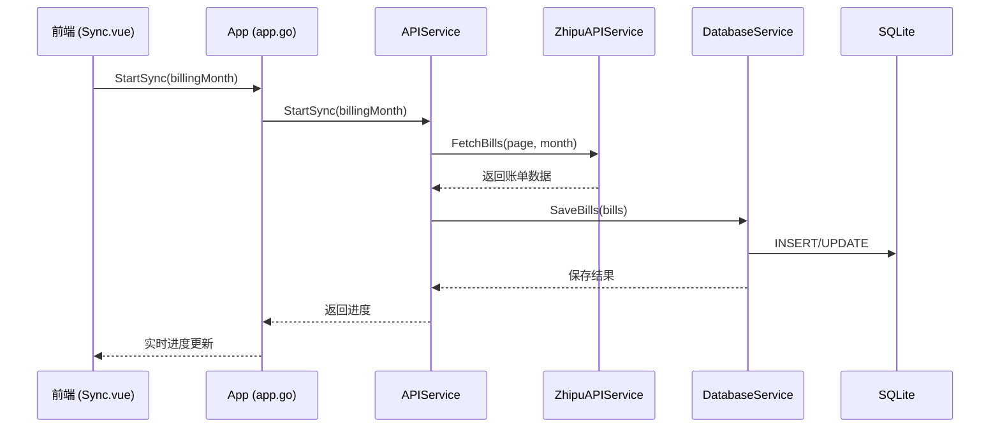

# CLAUDE.md

This file provides guidance to Claude Code (claude.ai/code) when working with code in this repository.

## 项目概述

这是一个基于 Wails v2 框架开发的桌面应用程序，用于统计智谱AI GLM Coding Plan 的账单信息。项目从原来的 Node.js 后端架构转换为 Go 后端 + Vue3 前端的桌面应用，支持编译为 Windows 和 macOS 可执行文件。

## 技术栈

- **后端框架**: Wails v2 (Go 1.23)
- **前端框架**: Vue 3 + Vite
- **UI 组件库**: Element Plus
- **图表库**: ECharts + Chart.js + vue-echarts + vue-chartjs
- **数据库**: SQLite3
- **HTTP 客户端**: Axios
- **日期处理**: Day.js

## 开发环境要求

- Go 1.23+
- Node.js 24.7.0+
- npm 11.5.1+
- Wails v2.10.2+

## 常用开发命令

### 前端开发
```bash
cd src/frontend
npm install          # 安装依赖
npm run dev          # 启动开发服务器
npm run build        # 构建生产版本
npm run preview      # 预览构建结果
```

### Wails 应用开发
```bash
cd src
wails dev            # 启动开发模式（前端热重载 + Go 后端）
wails build          # 构建生产版本（生成桌面应用）
wails build -clean   # 清理并重新构建
```

### 模块安装
```bash
cd src/frontend
npm install [package-name]    # 安装前端依赖
go mod tidy                    # 整理 Go 依赖
go get [package-name]         # 安装 Go 依赖
```

## 项目架构

### 高层次架构
本项目采用 **Wails v2 框架**的典型前后端分离架构，通过 IPC (进程间通信) 实现前后端数据交互：

```
┌─────────────────────────────────────────────────────────────┐
│                        前端层 (Vue3)                          │
│  ┌──────────────┐ ┌──────────────┐ ┌──────────────┐        │
│  │   Stats.vue  │ │  Bills.vue   │ │  Sync.vue    │        │
│  └──────┬───────┘ └──────┬───────┘ └──────┬───────┘        │
│         │                │                │                 │
│  ┌──────▼───────┐ ┌──────▼───────┐ ┌──────▼───────┐        │
│  │ Components/  │ │   Router     │ │  Composables │        │
│  └──────┬───────┘ └──────┬───────┘ └──────┬───────┘        │
│         │                │                │                 │
│  ┌──────▼──────────────────────────────────────────────┐   │
│  │              API 调用层 (api/index.js)               │   │
│  └──────────────────────┬──────────────────────────────┘   │
└─────────────────────────┼──────────────────────────────────┘
                          │ IPC 调用 (Wails bindings)
┌─────────────────────────┼──────────────────────────────────┐
│  ┌──────────────────────▼──────────────────────────────┐   │
│  │               后端层 (Go) - Wails Runtime            │   │
│  │                                                       │   │
│  │  app.go (主应用结构):                                │   │
│  │  ├─ 60+ 导出方法 (Frontend API)                     │   │
│  │  ├─ 数据聚合与转换                                   │   │
│  │  └─ 生命周期管理 (startup/shutdown)                  │   │
│  │                                                       │   │
│  │  api_bindings.go:                                    │   │
│  │  └─ 前端参数转换与API调用封装                        │   │
│  └──────────────────────┬──────────────────────────────┘   │
┌─────────────────────────┼──────────────────────────────────┐
│  ┌──────────────────────▼──────────────────────────────┐   │
│  │                 服务层 (services/)                   │   │
│  │  ├─ APIService (API聚合与协调)                      │   │
│  │  ├─ DatabaseService (数据库操作)                     │   │
│  │  ├─ StatisticsService (统计计算)                     │   │
│  │  ├─ ZhipuAPIService (智谱AI通信)                    │   │
│  │  ├─ AutoSyncService (自动同步调度)                   │   │
│  │  └─ ErrorHandler (错误处理)                          │   │
│  └──────────────────────┬──────────────────────────────┘   │
└─────────────────────────┼──────────────────────────────────┘
                          │
┌─────────────────────────┼──────────────────────────────────┐
│  ┌──────────────────────▼──────────────────────────────┐   │
│  │                数据持久层 (SQLite3)                  │   │
│  │  ├─ expense_bills (账单明细)                         │   │
│  │  ├─ api_tokens (API配置)                             │   │
│  │  ├─ sync_history (同步历史)                          │   │
│  │  ├─ auto_sync_config (自动同步配置)                  │   │
│  │  └─ membership_tier_limits (会员等级)                │   │
│  └──────────────────────────────────────────────────────┘   │
└─────────────────────────────────────────────────────────────┘
```

### 目录结构
```
src/
├── app.go                    # 主应用结构（60+ 导出方法）
├── main.go                   # 应用入口点 + Wails配置
├── wails.json                # Wails 配置文件
├── go.mod                    # Go 模块依赖
│
├── api_bindings.go           # 前端API绑定层（参数转换）
├── database.go               # 数据库初始化与管理
├── database_migrations.go    # 数据库迁移脚本
│
├── middleware/               # 中间件层
│   └── validation.go         # 输入验证
│
├── models/                   # 数据模型
│   ├── models.go             # 核心数据结构 (ExpenseBill, APIToken等)
│   ├── response.go           # API响应结构
│   └── transform.go          # 数据转换逻辑
│
├── services/                 # 服务层 (依赖注入架构)
│   ├── api.go                # APIService (入口服务)
│   ├── database.go           # DatabaseService
│   ├── statistics.go         # StatisticsService
│   ├── zhipu_api.go          # ZhipuAPIService
│   ├── auto_sync.go          # AutoSyncService
│   ├── sync.go               # 同步逻辑
│   ├── error_handler.go      # 错误处理
│   └── dependency_injection.go # 依赖注入容器
│
├── frontend/                 # Vue3 前端代码
│   ├── src/
│   │   ├── views/            # 页面组件
│   │   │   ├── Stats.vue     # 统计展示
│   │   │   ├── Bills.vue     # 账单管理
│   │   │   ├── Sync.vue      # 数据同步
│   │   │   ├── Settings.vue  # 设置管理
│   │   │   └── Onboarding.vue # 引导页面
│   │   ├── components/       # 公共组件 (图表、卡片)
│   │   ├── router/           # 路由配置 (路由守卫)
│   │   ├── api/              # API调用封装 (axios)
│   │   ├── composables/      # Vue3 组合式函数
│   │   └── utils/            # 工具函数
│   ├── package.json          # 前端依赖配置
│   └── vite.config.js        # Vite 构建配置
│
└── build/                    # 构建输出目录
    ├── bin/                  # 可执行文件输出
    ├── darwin/               # macOS 构建配置
    └── windows/              # Windows 构建配置
```

### 应用配置
- **应用名称**: glm-usage-monitor
- **窗口尺寸**: 1280x768 (main.go:22)
- **背景色**: RGBA(27, 38, 54, 1)
- **前端开发服务器**: http://localhost:34115
- **资源嵌入**: `frontend/dist` 目录通过 Go embed 嵌入
- **IPC绑定**: main.go:28-30 数组中注册 App 实例的所有导出方法

## 核心功能模块

### 1. 数据同步模块 (Sync.vue)
- 调用智谱AI API 获取账单数据
- 支持增量同步和全量同步
- 实时进度监控和状态展示
- 异步处理避免界面阻塞

### 2. 统计展示模块 (Stats.vue)
- 近5小时调用次数统计
- Token 使用量分析
- 会员等级限制提醒
- 可视化图表展示（ECharts）

### 3. 账单管理模块 (Bills.vue)
- 账单列表展示和筛选
- 详细账单信息查看
- 数据导出功能

### 4. 设置管理模块 (Settings.vue)
- API Token 配置
- 自动同步设置
- 数据库管理

### 5. 引导页面模块 (Onboarding.vue)
- 初次使用引导
- 基础配置设置

## 数据库设计

### 数据存储位置
- **macOS**: `~/.glm-usage-monitor/expense_bills.db`
- **Windows**: `%USERPROFILE%\.glm-usage-monitor\expense_bills.db`

### 核心表结构
```sql
-- expense_bills: 账单明细表 (models/models.go:8-82)
-- 包含智谱AI返回的所有字段 + 扩展字段
expense_bills (
  id (string, UUID),              -- 主键
  model_product_name (string),    -- 模型产品名称
  charge_unit (float),            -- Token使用量
  charge_count (float),           -- 调用次数
  cash_cost (float),              -- 现金成本
  transaction_time (datetime),    -- 交易时间
  time_window_start/end (datetime), -- 时间窗口
  customer_id (string),           -- 客户ID
  billing_no (string),            -- 账单号
  ...                            -- 40+ 字段
)

-- api_tokens: API Token 配置表 (models/models.go:85-102)
api_tokens (
  id (int),                        -- 主键
  token_value (string),            -- Token值（加密存储）
  provider (string),               -- 提供商 (智谱AI)
  is_active (bool),                -- 是否启用
  daily_limit (int),               -- 每日限制
  expires_at (datetime),           -- 过期时间
  created_at/updated_at (datetime)
)

-- sync_history: 同步历史表 (models/models.go:105-123)
sync_history (
  id (int),                        -- 主键
  sync_type (string),              -- 同步类型 (full/incremental)
  status (string),                 -- 状态 (running/success/failed)
  records_synced (int),            -- 已同步记录数
  billing_month (string),          -- 账单月份
  start_time/end_time (datetime),  -- 开始/结束时间
  error_message (text),            -- 错误信息
  duration (int)                   -- 持续时间(秒)
)

-- auto_sync_config: 自动同步配置表 (models/models.go:126-143)
auto_sync_config (
  id (int),                        -- 主键
  enabled (bool),                  -- 是否启用
  frequency_seconds (int),         -- 同步频率(秒)
  sync_type (string),              -- 同步类型
  last_sync_time (datetime),       -- 最后同步时间
  next_sync_time (datetime),       -- 下次同步时间
  billing_month (string)           -- 默认账单月份
)

-- membership_tier_limits: 会员等级表 (models/models.go:146-161)
membership_tier_limits (
  id (int),
  tier_name (string),              -- 等级名称 (Free/Pro等)
  daily_limit (int),               -- 每日调用限制
  monthly_limit (int),             -- 每月调用限制
  max_tokens (int),                -- Token限制
  call_limit (int),                -- 次数限制
  features (text)                  -- 特性说明
)
```

### 迁移系统 (database_migrations.go)
- **版本化迁移**: 通过 `GetMigrations()` 函数获取所有迁移脚本
- **自动执行**: app.go:37-40 在应用启动时自动运行迁移
- **向后兼容**: 支持添加字段 (ALTER TABLE ADD COLUMN)，保持向后兼容
- **索引优化**: 为高频查询字段添加索引 (customer_id, billing_date, transaction_time)

### 字段映射与转换
- **时间窗口处理**: `timeWindow` 字段拆分为 `time_window_start` 和 `time_window_end`
- **时间戳提取**: 从 `billingNo` 字段提取13位时间戳，转换为 `transaction_time`
- **ID 主键**: 使用 UUID 作为 `expense_bills` 表主键，避免分布式ID冲突
- **创建时间**: 所有记录自动添加 `create_time` 字段（数据库当前时间）

## API 集成

### 智谱AI账单查询接口
```bash
curl --request GET \
  --url 'https://bigmodel.cn/api/finance/expenseBill/expenseBillList?billingMonth=2025-11&pageNum=1&pageSize=20' \
  --header 'Authorization: Bearer 用户的Token'
```

### 数据处理要求
1. **timeWindow 拆分**: 将返回的 timeWindow 字段拆分为 start 和 end 两个字段
2. **时间戳提取**: 从 billingNo 字段截取 customerId 之后的13位时间戳，转换为 transaction_time
3. **字段映射**: API 返回字段与数据库表字段一一对应
4. **记录创建时间**: 每条记录都需要 create_time 字段

## 前端开发规范

### 样式约定
- **主色调**: #4D6782（莫兰迪色系）
- **背景**: 渐变色 #f5f5f3 0% 到 #e8e6e1 100%
- **毛玻璃效果**: header 使用 backdrop-filter: blur(8px)
- **圆角规范**: 统一使用 Element Plus 的圆角样式
- **禁止使用**: 严格禁止在代码、文档、UI中使用 emoji 图标

### 路由结构
- `/stats`: 统计信息页面
- `/bills`: 账单列表页面
- `/sync`: 数据同步页面
- `/settings`: 设置页面
- `/onboarding`: 引导页面（无 header）

### 状态管理
- 使用 Vue3 Composition API
- 通过 wailsjs/go 目录调用后端 Go 方法
- 前后端数据传递使用 JSON 格式

## 后端开发规范

### 服务层架构 (services/)

项目采用**依赖注入**的服务层架构，实现关注点分离：

```go
// services/api.go (APIService - 入口服务)
type APIService struct {
    dbService       *DatabaseService      // 数据库操作
    statsService    *StatisticsService    // 统计计算
    zhipuAPIService *ZhipuAPIService      // 智谱AI通信
    autoSyncService *AutoSyncService      // 自动同步
    db              DatabaseInterface     // 数据库接口
    errorHandler    ErrorHandler          // 错误处理
}

// services/database_interface.go (接口定义)
type DatabaseInterface interface {
    GetDB() *sql.DB
    GetPath() string
}
```

**服务职责分工**:
- **APIService**: 前端API入口，聚合协调其他服务 (services/api.go)
- **DatabaseService**: 底层数据库CRUD操作 (services/database.go)
- **StatisticsService**: 统计分析与计算 (services/statistics.go)
- **ZhipuAPIService**: 智谱AI API通信 (services/zhipu_api.go)
- **AutoSyncService**: 定时任务调度 (services/auto_sync.go)
- **ErrorHandler**: 统一错误处理与日志 (services/error_handler.go)

### Wails IPC 绑定机制

#### 1. 方法注册 (main.go:28-30)
所有前端可调用的方法必须在 `Bind` 数组中注册：
```go
Bind: []interface{}{
    app,  // 注册App实例的所有导出方法
}
```

#### 2. 导出方法约定 (app.go)
- **命名**: 使用 PascalCase (如 `GetBills`, `StartSync`)
- **参数**: 可接收前端传递的 JSON 数据（自动反序列化）
- **返回**: 支持 `error` 类型，Wails 会自动转换为前端错误
- **示例**:
```go
func (a *App) GetBills(filter interface{}) (*models.PaginatedResult, error) {
    // ... 参数转换与API调用
}
```

#### 3. 前端绑定生成
运行 `wails dev` 或 `wails build` 时，Wails 会自动生成 TypeScript 类型定义：
- **位置**: `src/frontend/wailsjs/go/main/App.js`
- **使用**: 前端通过 `import { GetBills } from '../wailsjs/go/main/App'` 调用

#### 4. API绑定层 (api_bindings.go)
处理前端参数转换，隔离 Wails IPC 细节：
```go
func (a *App) GetBills(filter interface{}) (*models.PaginatedResult, error) {
    // 前端传递的 map[string]interface{} 转换为内部模型
    var billFilter *models.BillFilter
    if filterMap, ok := filter.(map[string]interface{}); ok {
        billFilter = &models.BillFilter{
            PageNum:  int(filterMap["page_num"].(float64)),
            PageSize: int(filterMap["page_size"].(float64)),
            // ...
        }
    }
    return a.apiService.GetBills(billFilter)
}
```

### 数据库操作规范

#### 连接管理 (database.go)
```go
// 数据库初始化
func NewDatabase() (*Database, error) {
    dbPath := getDefaultDBPath()
    db, err := sql.Open("sqlite3", dbPath)
    // 设置连接池参数、启用WAL模式等
}

// 生命周期管理
func (a *App) startup(ctx context.Context) {
    db, err := NewDatabase()
    a.database = db
    // 执行迁移...
}
```

#### 数据库服务 (services/database.go)
- **参数化查询**: 防止 SQL 注入
- **事务处理**: 保证数据一致性
- **错误处理**: 统一错误类型与日志记录
- **资源管理**: 及时关闭 ResultSet

#### 迁移系统 (database_migrations.go)
```go
type MigrationScript struct {
    Version     int
    Description string
    SQL         string
}

func GetMigrations() []MigrationScript {
    return []MigrationScript{
        {
            Version:     1,
            Description: "添加缺失字段",
            SQL:         "ALTER TABLE expense_bills ADD COLUMN ...",
        },
        // ...
    }
}

// app.go:38 自动执行迁移
if err := RunMigrations(db.GetDB()); err != nil {
    log.Fatalf("Failed to run migrations: %v", err)
}
```

### 错误处理机制 (services/error_handler.go)

项目实现了分层错误处理：
```go
// 错误类型定义
const (
    ErrorTypeDatabase = "DATABASE"
    ErrorTypeAPI      = "API"
    ErrorTypeValidation = "VALIDATION"
)

// 错误包装与上下文
func WrapError(err error, errorType, code, message string) *AppError {
    return &AppError{
        Type:    errorType,
        Code:    code,
        Message: message,
        Err:     err,
    }
}

// 统一错误处理
func (s *APIService) GetBills(filter *models.BillFilter) (*models.PaginatedResult, error) {
    err := SafeExecute(func() error {
        return s.dbService.GetExpenseBills(filter)
    })

    if err != nil {
        context := map[string]interface{}{"operation": "GetBills"}
        s.errorHandler.HandleError(err, context)
        return nil, WrapError(err, ErrorTypeDatabase, ErrCodeDBQueryFailed, "Failed to retrieve bills")
    }
}
```

## 开发注意事项

### 性能优化
- 大量数据同步时使用分页和异步处理
- 图表数据应进行适当的聚合和缓存
- 数据库查询添加必要索引

### 用户体验
- 提供实时进度反馈
- 友好的错误提示信息
- 响应式布局适配不同屏幕尺寸

### 安全考虑
- API Token 安全存储（不提交到版本控制）
- 数据库文件权限控制
- 输入数据验证和清理

## 构建和部署

### 开发模式
```bash
cd src
wails dev  # 启动开发服务器 (http://localhost:34115)
           # 特性: 前端热重载、实时错误显示、调试工具集成
```

### 生产构建

#### 方式1: 使用构建脚本（推荐）
```bash
# macOS/Linux
./build.sh                           # 构建当前平台
./build.sh -c                        # 清理并构建
./build.sh -p all -a all             # 构建所有平台和架构

# Windows
build.bat                            # 构建当前平台
build.bat -c                         # 清理并构建
build.bat -p all -a all              # 构建所有平台和架构
```

#### 方式2: 使用 Wails CLI
```bash
cd src
wails build                          # 构建当前平台
wails build -platform windows -amd64 # 构建 Windows amd64
wails build -platform darwin -arm64  # 构建 macOS ARM64
wails build -clean                   # 清理并构建
wails build -compress                # 启用压缩
wails build -ldflags "-s -w"         # 减小文件大小
```

### 构建参数说明
| 参数 | 简写 | 说明 | 可选值 | 默认值 |
|------|------|------|--------|--------|
| `--platform` | `-p` | 目标平台 | `darwin`, `windows`, `all` | `current` |
| `--arch` | `-a` | 目标架构 | `amd64`, `arm64`, `all` | `current` |
| `--clean` | `-c` | 构建前清理 | - | `false` |
| `--dev` | `-d` | 开发模式构建 | - | `false` |
| `--output` | `-o` | 输出目录 | 路径 | `./build/bin` |

### 构建产物位置
- **Windows**: `src/build/bin/glm-usage-monitor.exe` (~12-15 MB)
- **macOS**: `src/build/bin/glm-usage-monitor.app` (~12-15 MB)
- 前端资源已通过 Go embed 嵌入到可执行文件中，无需额外部署

### 环境要求
- **Go**: 1.23+ ([安装指南](https://go.dev/doc/install))
- **Node.js**: 24.7.0+ ([官网](https://nodejs.org/))
- **Wails CLI**: v2.10.2+ ([安装指南](https://wails.io/docs/gettingstarted/installation))
- **macOS 构建**: 需 Xcode Command Line Tools
- **Windows 构建**: 需 TDM-GCC/MinGW-w64 ([TDM-GCC](https://jmeubank.github.io/tdm-gcc/))

### 跨平台构建示例
```bash
# 在 macOS 上构建 Windows 版本
./build.sh -p windows -a amd64

# 构建所有平台
./build.sh -p all -a all

# 压缩优化构建
wails build -compress -ldflags "-s -w"
```

### 部署说明
- **macOS**: 将 `.app` 拖到 Applications 目录，首次运行需在"系统偏好设置 > 安全性与隐私"中允许
- **Windows**: 直接运行 `.exe`，首次运行可能需通过 Windows Defender 检查
- 数据目录: `~/.glm-usage-monitor/` (macOS) 或 `%USERPROFILE%\.glm-usage-monitor\` (Windows)

## 故障排除

### 常见问题与解决方案

#### 构建问题

**Q: 前端依赖安装失败**
```bash
# 错误示例
npm ERR! peer dep missing
```
**A**: 检查 Node.js 版本
```bash
node --version  # 应为 24.7.0+
npm --version   # 应为 11.5.1+
cd src/frontend && rm -rf node_modules package-lock.json
npm install      # 重新安装依赖
```

**Q: Wails 构建失败**
```bash
# 错误示例
go: not found: sql.DB
```
**A**:
- 确保 Go 版本为 1.23+: `go version`
- 确保 Wails CLI 已安装: `wails version` (应为 v2.10.2+)
- 提示 "not found: sql.DB" 是 Wails 已知问题，不影响构建结果

**Q: Windows 构建失败**
**A**: 安装必要工具
1. 安装 [TDM-GCC](https://jmeubank.github.io/tdm-gcc/) 或 MinGW-w64
2. 安装 [Git for Windows](https://git-scm.com/download/win)
3. 重启终端后重试

**Q: 构建产物过大** (>20MB)
**A**: 启用压缩优化
```bash
cd src
wails build -compress -ldflags "-s -w"
# 或使用构建脚本
./build.sh -p current -a current -c
```

#### 运行时问题

**Q: API 调用失败**
**A**:
1. 检查 Token 配置: Settings > API Token
2. 验证网络连接: curl 测试智谱AI API
3. 查看后端日志: 应用启动时的控制台输出
4. 数据库路径权限: 确保 `~/.glm-usage-monitor/` 可写

**Q: 数据库错误**
```bash
# 错误示例
database is locked
```
**A**:
- 确保应用未重复运行
- 删除 `~/.glm-usage-monitor/expense_bills.db-wal` 和 `-shm` 文件
- 重新启动应用触发数据库重建

**Q: 同步失败**
**A**:
1. 检查 `sync_history` 表的 `error_message` 字段
2. 验证智谱AI Token 是否有效
3. 手动清理卡住的同步记录: `UPDATE sync_history SET status='failed' WHERE status='running'`

### 环境检查清单

```bash
# 检查 Go 版本
go version  # 应输出: go version go1.23.x

# 检查 Node.js 版本
node --version  # 应输出: v24.7.0+
npm --version   # 应输出: 11.5.1+

# 检查 Wails 版本
wails version  # 应输出: v2.10.2+

# 检查数据库路径
ls -la ~/.glm-usage-monitor/  # macOS
dir %USERPROFILE%\.glm-usage-monitor\  # Windows
```

### 调试技巧

#### 开发模式调试
```bash
cd src
wails dev  # 启动开发服务器
```
- **前端调试**: 浏览器访问 http://localhost:34115，使用 DevTools
- **后端调试**: 查看终端输出的 Wails 日志
- **API 测试**: 浏览器控制台直接调用 Wails 绑定方法

**注意**: `wails dev` 模式与生产构建存在差异，某些功能（如自动同步）可能行为不同。**必须通过 `wails build` 生成可执行文件进行完整测试**。

#### 日志分析
```bash
# 查看应用日志
tail -f ~/.glm-usage-monitor/logs/app.log  # macOS
type %USERPROFILE%\.glm-usage-monitor\logs\app.log  # Windows

# 查看数据库操作日志
# 开启 SQLite 日志: 在 database.go 中添加
db.SetLogger(log.New(os.Stdout, "", 0))
```

#### 性能分析
```bash
# Go 性能分析 (开发模式)
cd src
wails dev -trace
# 访问 http://localhost:34115/debug/pprof/
```

### 清理与重建

```bash
# 完全清理 (推荐)
./build.sh -c  # 使用构建脚本
# 或手动清理:
rm -rf src/build/bin
rm -rf src/frontend/dist
cd src && wails build -clean

# 重建依赖
cd src/frontend && rm -rf node_modules package-lock.json && npm install
cd src && go mod tidy && go get ./...
```

### 常见错误码

| 错误码 | 含义 | 解决方案 |
|--------|------|----------|
| `DB_QUERY_FAILED` | 数据库查询失败 | 检查数据库文件权限和完整性 |
| `API_TOKEN_INVALID` | API Token 无效 | 重新配置有效的智谱AI Token |
| `SYNC_TIMEOUT` | 同步超时 | 检查网络连接，尝试减少同步数据量 |
| `MIGRATION_FAILED` | 数据库迁移失败 | 备份数据后删除数据库文件重建 |

## 关键工作流程

### 数据同步流程


### 前后端通信数据流

#### 1. 前端调用后端 (Vue3 -> Go)
```javascript
// frontend/src/api/index.js
import { GetBills } from '../wailsjs/go/main/App'

export default {
  getBills: async (params) => {
    try {
      const result = await GetBills(params)
      return { success: true, data: result }
    } catch (error) {
      return { success: false, error: error.message }
    }
  }
}
```

#### 2. 后端方法绑定 (Go)
```go
// app.go (导出方法)
func (a *App) GetBills(filter interface{}) (*models.PaginatedResult, error) {
    // 1. 参数转换 (api_bindings.go:14-44)
    billFilter := convertToBillFilter(filter)

    // 2. 调用服务层 (services/api.go:44-78)
    result, err := a.apiService.GetBills(billFilter)

    // 3. 返回值自动序列化为JSON
    return result, err
}
```

#### 3. 数据转换与存储
```go
// models/transform.go (数据转换逻辑)
func TransformBillData(apiBill *ZhipuBill) *models.ExpenseBill {
    // 1. 从 billingNo 提取时间戳
    timestamp := extractTimestamp(apiBill.BillingNo)

    // 2. 拆分时间窗口
    start, end := splitTimeWindow(apiBill.TimeWindow)

    // 3. 映射到数据库模型
    return &models.ExpenseBill{
        TransactionTime:   time.Unix(timestamp/1000, 0),
        TimeWindowStart:   start,
        TimeWindowEnd:     end,
        CreateTime:        time.Now(),
        // ... 字段映射
    }
}
```

### 关键提醒

#### 新增 API 方法的完整流程
1. **在 app.go 中添加导出方法** (60+ 方法模式)
2. **在 api_bindings.go 中处理参数转换** (如需要)
3. **在 services/api.go 中实现业务逻辑** (或调用其他服务)
4. **运行 `wails dev`** 生成 TypeScript 绑定
5. **在前端调用新方法** (api/index.js 或直接在组件中)

#### 数据库迁移的完整流程
1. **在 database_migrations.go 中添加 MigrationScript**
2. **重启应用自动执行迁移** (app.go:38)
3. **验证迁移结果** (检查数据库表结构)
4. **更新 models/models.go** 同步字段定义

#### 添加新服务或修改服务层
1. **定义接口** (services/*_interface.go)
2. **实现服务** (services/*.go)
3. **在 dependency_injection.go 中注册** (如果使用DI容器)
4. **在 APIService 中注入依赖** (services/api.go:23-38)
5. **添加错误处理** (services/error_handler.go)

#### 性能优化要点
- **分页查询**: 所有账单查询必须使用分页 (BillFilter.PageSize)
- **数据库索引**: 新增查询字段需考虑添加索引
- **异步处理**: 长时间操作 (同步、统计) 应使用 goroutine
- **连接池**: SQLite 设置合理的连接池参数 (database.go)

#### 测试策略
- **开发模式测试**: `wails dev` 用于快速调试
- **生产构建测试**: `wails build` 必须运行可执行文件验证
- **API 测试**: 使用浏览器控制台或 Postman 测试 IPC 调用
- **数据库测试**: 验证迁移脚本和查询性能

## 重要文件路径速查

| 功能 | 关键文件 |
|------|---------|
| 应用入口 | `src/main.go` |
| 核心逻辑 | `src/app.go` (60+ 方法) |
| API 绑定 | `src/api_bindings.go` |
| 数据模型 | `src/models/models.go` |
| 数据库服务 | `src/services/database.go` |
| API 服务 | `src/services/api.go` |
| 智谱AI通信 | `src/services/zhipu_api.go` |
| 自动同步 | `src/services/auto_sync.go` |
| 数据库迁移 | `src/database_migrations.go` |
| 前端路由 | `src/frontend/src/router/index.js` |
| 前端API | `src/frontend/src/api/index.js` |
| 构建脚本 | `build.sh` / `build.bat` |
| Wails配置 | `src/wails.json` |